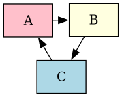

# `la.captions`

This extension lets you assign captions to document elements, and wraps them (as appropriate) in the HTML elements intended for this purpose: `<figcaption>` within `<figure>`, and/or `<caption>` within `<table>`.

Once so structured, these figures, tables and captions can be styled with CSS and numbered using [`la.labels`](labels.md).

To caption an element:

1. Write the caption itself as an ordinary Markdown paragraph ([or block quote](#complex)) _before_ the element you are captioning, with a paragraph break in between.

2. Attach the `-caption` directive to the caption. (The `attr_list` extension will be loaded automatically for this purpose, but you can also use [`la.attr_prefix`](attr_prefix.md).)


## Basic Example

Here's how it works in simple cases:

/// markdown-demo
    resources:
        - docs/extensions/diagram1.png
    show_html_body: True
    output_height: 28em

    import lamarkdown as la
    la('la.captions')
    la.css('''
        figure { border: 1px solid gray;
                 padding: 1em; }
    ''')
    ---
    Some ordinary document text.

    A diagram for your
    consideration.
    {-caption}

    

    Some more ordinary document text.
///


!!! note "Design Notes"

    An alternate (hypothetical) approach would be to write captions as values of the `-caption` directive itself, e.g.:

    ```markdown
    {-caption="A diagram for your consideration."}
    

    <!-- Not actually how it works! -->
    ```

    This alternate approach would be unnecessarily limiting, because no Markdown processing occurs within attribute values. Thus, a caption would be limited to a single paragraph of text devoid of formatting, links, or any other semantic structure. There seems no advantage to this.

    Also, in the actual approach taken, captions must be written _above_ (not below) their captioned elements, because:

    * This is consistent with the traditional placement of table captions.

    * Though figure captions traditionally appear underneath figures, this applies to formatted documents, where figures can be viewed as the pictures or diagrams they are intended to be. In Markdown, the code representing a figure usually won't have any meaning on its own, at a glance.

    * We need a consistent rule. We can't permit captions to appear _either_ above _or_ below, without creating ambiguity or additional complexity.

    This only applies to the `.md` file itself. The HTML document can be styled so that captions appear anywhere you wish.


## Tables

When captioning a table, the HTML structure will use the `<table>` and `<caption>` elements. (The default styling may show the caption protruding outside the physical table boundary, but it's still logically part of the table.)

/// markdown-demo
    resources:
        - docs/extensions/diagram1.png
    show_html_body: True

    import lamarkdown as la
    la('la.captions', 'tables')
    la.css('''
        table  { border: 1px solid red; }
        td, th { border: 1px solid blue; }
    ''')
    ---
    A table for your
    consideration.
    {-caption}

    Heading A | Heading B
    --------- | ---------
    One       | Two
    Three     | Four
///


## Complex Captions {#complex}

If a caption requires more than one paragraph and/or other block elements, then:

1. You can represent it using the Markdown "block quote" syntax (prefixing lines with `>`), _but also_
2. You will need to use [`la.attr_prefix`](attr_prefix.md) in order to attach the `-caption` directive _above_ the block quote. (You can do this regardless, even in simpler cases, if you wish.)

/// markdown-demo
    resources:
        - docs/extensions/diagram1.png
    show_html_body: True
    output_height: 30em

    import lamarkdown as la
    la('la.captions', 'la.attr_prefix')
    la.css('figure { border: 1px solid gray; '
           '         padding: 1em; }')
    ---
    {-caption}
    > A diagram for your
    > consideration.
    >
    > It requires some complex explanation:
    >
    > * First, here's a list item.
    > * Second, there's another.

    
///


## Options

{-list-table}

* #
    - Option
    - Description

*   - `directives`
    - An object for retrieving directives from HTML tree elements. This should be an instance of `lamarkdown.lib.directives.Directives`, and the extension will reuse Lamarkdown's "current" instance by default, if available.

*   - `progress`
    - An object accepting error, warning and progress messages. This should be an instance of `lamarkdown.lib.Progress`, and the extension will reuse Lamarkdown's "current" instance by default, if available.

*   - `autowrap_listings`
    - `False` by default. If `True`, wrap all code listings (`<pre>` elements containing a `<code>` element) in a `<figure>` element, even where no caption is provided. The theory is that listings are often less in need of a caption than ordinary figures or tables, but it may still be desirable to have them automatically numbered with the [`la.labels`](labels.md) extension (which would otherwise ignore them).

*   - `autowrap_maths`
    - `False` by default. If `True`, wrap all block-style MathML (`<math>`) elements in a `<figure>` element, even when no caption is provided. The same reasoning applies as for `autowrap_listings`.
