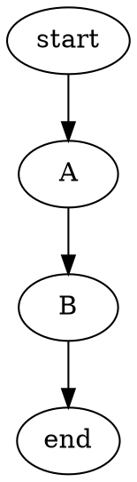

# `m.plots()`

Adds support for several text-based graphics tools. (In fact, this is loaded automatically by `m.doc()`.) You use the "fence" notation to write graphics commands, in an appropriate language. For instance:

~~~markdown

~~~

In this example, Lamarkdown will invoke the `dot` command from Graphviz (which draws diagrams with an automatic layout engine), pass it the `digraph X {...}` code, retrieve output in SVG (scalable vector graphics) format, and embed it in-place in the document. It will perform equivalent steps for other graphing/plotting notations as well.

The name after ```` ``` ```` indicates which notation/tool is to be used. Lamarkdown currently supports:

* `graphviz-circo`, `graphviz-dot`, `graphviz-fdp`, `graphviz-neato`, `graphviz-osage`, `graphviz-patchwork`, `graphviz-sfdp` and `graphviz-twopi` (all from [Graphviz](https://graphviz.org/) of course);
* [`plantuml`](https://plantuml.com/);
* [`matplotlib`](https://matplotlib.org/); and
* `r-plot` (R-based graphics). You will need to manually install these tools yourself (whichever one(s) you intend to use).

Note: Lamarkdown also supports [embedding LaTeX code](../extensions/latex.md), but this does not require fence notation.

